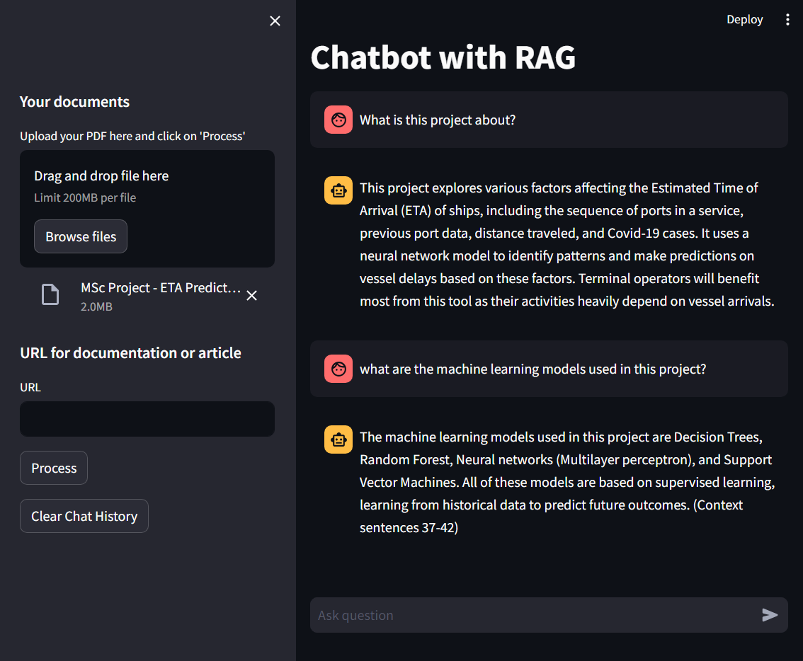

# RAG-with-LangChain-Chatbot
RAG implementation with LangChain using Ollama.ai


Retrieval-augmented generation (RAG) is an AI framework for retrieving facts from an external knowledge base to ground large language models (LLMs) on the most accurate, up-to-date information and to give users insight into LLMs' generative process.

This is 100% offline bot, So no data leak. With the streamlit webUI you can upload PDF or link any online document or article. then query the bot regarding it.

This is using Mistral:7B LLM model https://huggingface.co/TheBloke/Mistral-7B-Instruct-v0.2-GGUF
However with Ollama you can use many different models https://ollama.ai/library



This notebook file in the repo explain the code step by step

RAG-With-Chatbot-Explanation.ipynb


 ## Installation

 1. Install Ollama from https://ollama.ai
 2. Clone this repo
 3. create venv and install requirements.txt
 4. Set 
 ```bash
OLLAMA_URL 
```
to your OLLAMA URL, in app.py if you are using it on same machine it will be localhost

5. streamlit run.py


Note: If you want to do inferance in GPU, It used around 6GB VRAM for Mistral:7B model